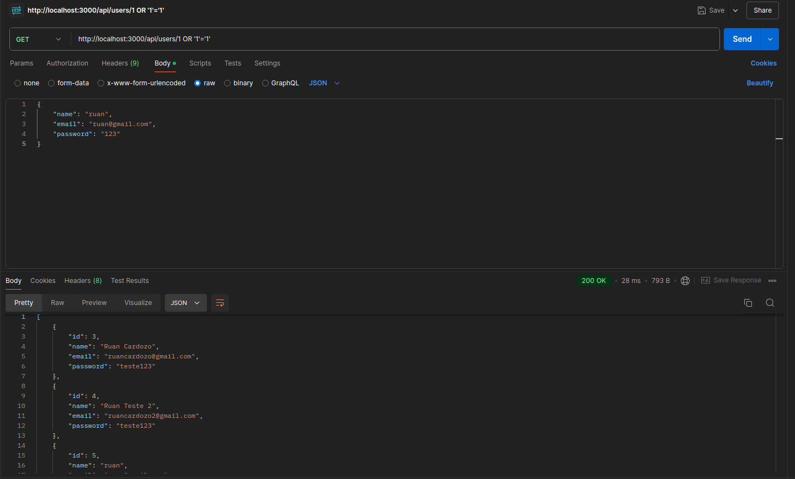

# SQL Injection:
1) Implementar este Ataque:
- No campo de nome de usuário, insira um comando SQL malicioso para obter todas as informações da tabela de usuários.
- Envie o formulário e observe o comportamento.

Para realizar o ataque foi feito na rota em que é buscado um usuário específico:

Ao invés de passar o id do usuário foi passado um script em sql que sempre é verdadeiro dessa forma retornando todos os usuários cadastrados na base de dados.

Abaixo segue o print de exemplo:



## Utilizando a rota post para cadastro de usuário

2) Aqui foi utilizado a vulnerabilidade na rota post e inserido um comando sql afim de deletar a tabela de users do banco de dados

Rota: `localhost:3000/api/users - POST`
Payload de exemplo: 
```json
{
    "name": "ruan cardozo 1",
    "email": "test@example.com'; DROP TABLE users; --",
    "password": "123" 
}
```

### SQL para criar a tabela novamente

```bash
docker exec -i cyber-sec-database psql -U node -d cyber-sec-database -c "CREATE TABLE users (
    id SERIAL PRIMARY KEY,
    name VARCHAR(100) NOT NULL,
    email VARCHAR(100) NOT NULL UNIQUE,
    password VARCHAR(100) NOT NULL
);"
```

---

# XSS - Cross Site Scripting

Aqui segue o vídeo de exemplo para um ataque de Cross Site Scripting(XSS)

Foi utilizado o input de email na tela de login da aplicação

Script Utilizado: 
```html

```
https://youtu.be/G3qQ9TvNyd8

---

# CSRF

Para implementar o ataque de CSRF, foram seguidos os seguintes passos:

1. Realizar o login na aplicação em `localhost:5173`.
2. Acessar a aplicação maliciosa em `localhost:5174`.

Como o usuário estava logado e não havia nenhuma proteção nos cookies, foi possível realizar um ataque Cross-Site Request Forgery (CSRF). Esse ataque permitiu que as credenciais do usuário fossem alteradas sem o seu consentimento.

- Exemplo de ataque:
    - https://youtu.be/Nvjp9Y4izAY